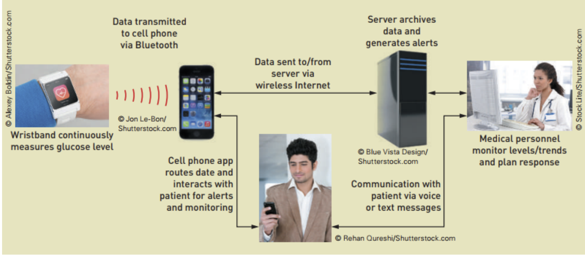

# Systems_Analysis_and_Design_Class_Final_Project
In this project, we will introduce to you how a Real-Time Continuous Glucose Monitoring (RTCGM) can be built from scratch. From what the system requirements and how to meet them, to declaring all the use cases and its actors. Represent contents through use case diagrams, activity diagrams, sequence diagrams,.... We also build an assumption of all the UI that the system needs.

## My project's score: 
* Score: 8/10